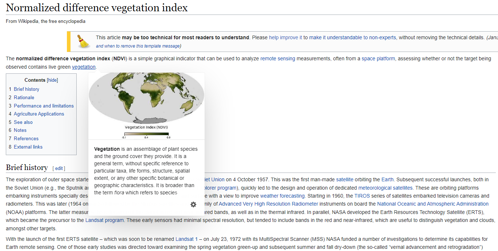
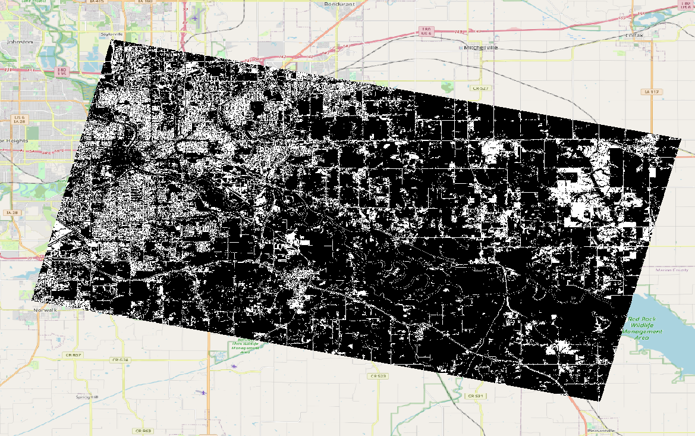

# NDVI Detection

The task is to determine NDVI values, reproject, scale, and output a geotiff based on another 8-band geotiff.

For more information, please refer to this [explanation](https://en.wikipedia.org/wiki/Normalized_difference_vegetation_index) on wikipedia.



## Prerequisite

To run the script, important python libraries are required.

- GDAL
- rasterio
- numpy

These can be installed in a new virtual env or found in a pre-existing docker image [Development Seed](https://developmentseed.org/blog/2017-08-17-introducing-geolambda) offers.

## How to

The script can be ran from the command line or included in a project as an import.

### Command line

The python script can be ran from the command line. Two arguments are required, an input and output file path, name.

`python app.py input.tif output.tif`

**Optional arguments** include `--crs` and `--range`.

Including `--crs` tells the app to reproject the output to the given projection.

Including `--range` tells the app to clamp the output NDVI values to the given range.

#### Example

*From README directory*

`python src/app.py sample/sample.tif output/output.tif --crs EPSG:4326 --range_min 0.2 --range_max 0.5`

The geotif included (`output/output.tif`) was generated by the above command.



### Imported

Once the script is copied over to your project or built/installed with python's wheel, you can access key functions to calculate NDVI values of a geotiff.

To access, either:

`import app`

`from app import evaluate_band_vegetation, evaluate_geotiff_vegetation`

Once imported, these two functions can be used to determine NDVI values.

#### Example Usage

```
import app
    
if __name__ == "__main__":
    fn_in = 'sample.tif'
    fn_out = 'output.tif'
    app.evaluate_geotiff_vegetation(fn_in, fn_out, crs='EPSG:4326', range=[0.3, 0.6])
```

Further documentation is included on the functions.